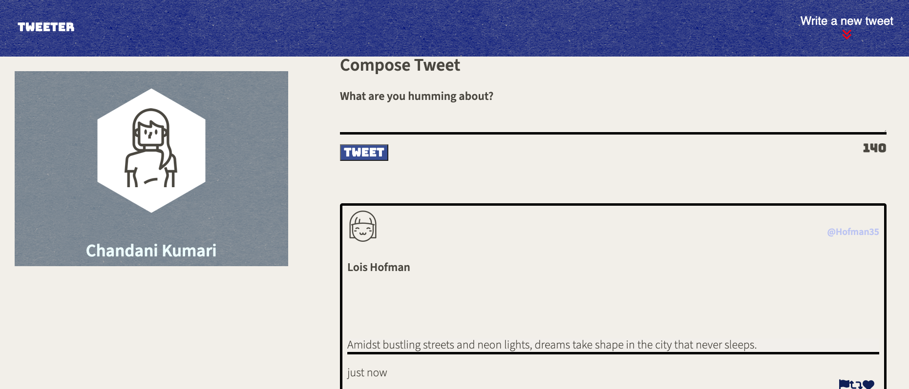
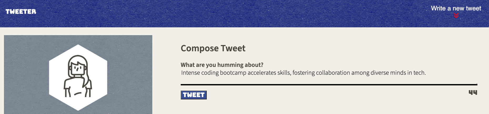
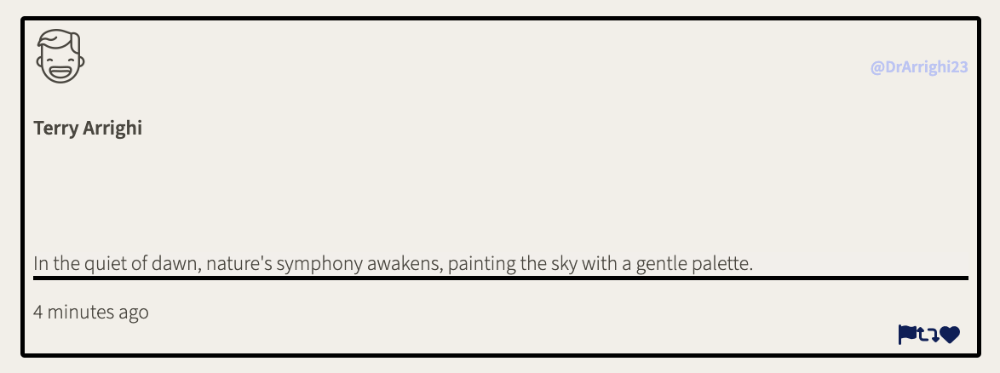
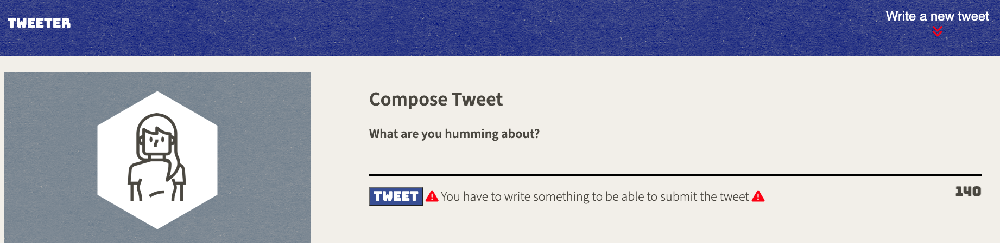

# Tweeter Project

A simple single-page AJAX based twitter clone that allows users to post their tweets.

## Glimpse Of Final Product

#### Main Page

#### Compose Tweet

#### Individual Tweet

#### Empty Tweet Error

## Dependencies

- Node.js
- Express
- EJS
- Body-parser
- Chance
- md5
- Timeago

## Dev-Dependencies
- nodemon

## Getting Started

- Install all dependencies (using the `npm install` command).
- Start the web server using the `npm run local` command.
- Navigate to http://localhost:8080/

Enjoy tweeting!!